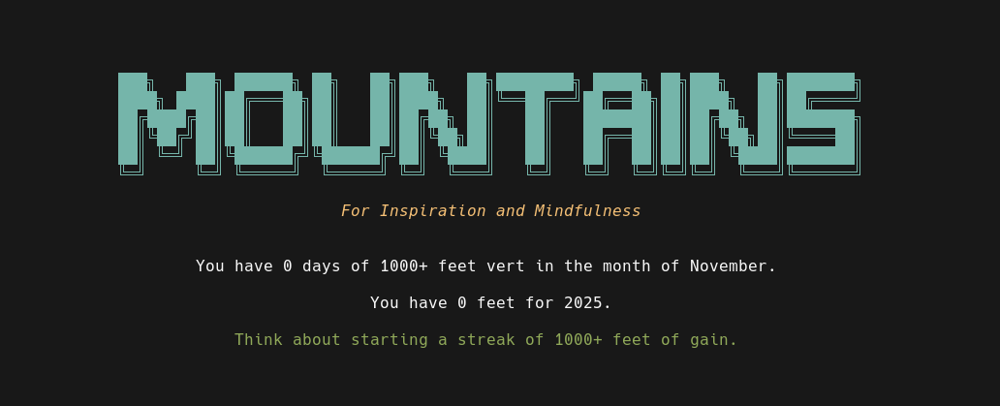

# Mountains

## For Inspiration and Mindfulness

### A Trail Running Training Log

#### _A digital tool to help runners get good at vert : )_



This is a terminal user interface training log I made for myself - to get lighter and to train with more awareness for trail running. It grew out of my desire to improve my ability to go faster uphill and run on trails for many miles.

**Mountains** can also help with food awareness - **initially my main motivation to create this software**.

As currently implemented, **Mountains** requires a Turso Cloud account and database.

The Turso Cloud database will sync with the `libsql` db created in the user's home directory at `~/.mountains/`.

This happens on startup and every 4 minutes while running the app.

The simplest way to install currently is to clone the repo, use the example `.env.example` to make your own `.env` file ( _which is listed in the `.gitignore` file with the repo_ ), fill in your credentials and build the application locally with:

`cargo install --path .`

Then create a `.mountains` directory in `$HOME`.

Or run the program for the first time and the directory will be created.

In order to use the app anywhere on the user's system post install - the program requires a `.env` file in `~/.mountains/` for Turso Cloud.

Ater cloning the project and entering credentials into a `.env` file in the project repository, do the following:

```shell

mkdir ~/.mountains
cp .env ~/.mountains/.env

```

Run the app in the project root with:

```shell

cargo run

```

Or after installing locally with `cargo`:

```shell

mountains

```

I plan on updating the app as I go along.

Also, a web version is in the works.

Right now, I am simply using it for my own training and health.
