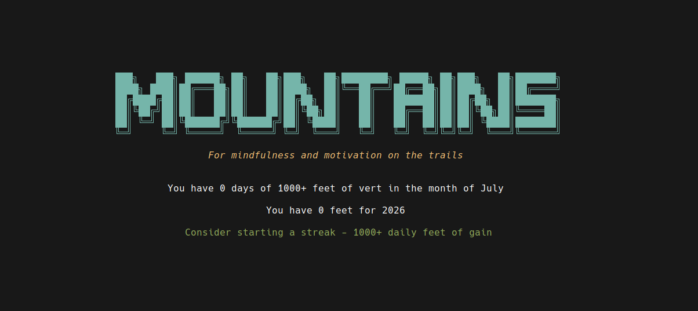

# Mountains

## For mindfulness and motivation on the trails

### Trail Running Training Log

#### _A digital tool to help runners **get good at vert** : )_



This is a TUI training log for trail running and food awareness.

Track daily nutrition, body measurements, miles, elevation gain, strength & mobility work, and notes.

Works offline-first with a local `libsql` database at `~/.mountains/`.

Optional Turso Cloud sync can be configured from within the app (press `c` on the startup screen).

Create a Turso account at [turso.tech](https://turso.tech/) and create a read / write libsql db. Copy over your database url and create a db auth token to input into the TUI.

`~/.mountains/` directory stores `config.toml` and `libsql` database files as well as markdown backup files of each day's entry.

# Installation

Clone the repo and install locally:

```shell

git clone git@github.com:papadavis47/mountains.git

cd mountains

cargo install --path .

# add --force if installing over an older version

# binary builds to ~/.cargo/bin

```

The `~/.mountains/` directory is created automatically on first run.

# Cloud Sync (Optional)

Cloud sync with Turso is opt-in. Configure it from the startup screen (`c`) or edit `~/.mountains/config.toml` directly:

```toml
[sync]
enabled = true
db_url = "libsql://your-db.turso.io"
auth_token = "your-token"
```

Syncs on startup (background) and on quit.

# Usage

```shell
cargo run
```

Or after installing:

```shell

mountains

```

Run `mountains --help` in terminal for more info

### Made with [ratatui](https://ratatui.rs/) :)
